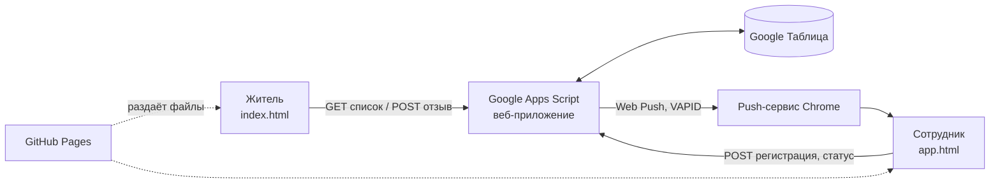

# Электрондук табел жана Онлайн табло — Төрт-Гүл айыл өкмөтү

Бесплатная система учёта рабочего времени сотрудников айыл өкмөтү и **публичное онлайн-табло для жителей**: кто сейчас на работе, кто в командировке или в отпуске, контакты сотрудников и форма отзывов с оценкой работы.

> **Бюджет проекта: 0 сом.** Всё построено на бесплатных сервисах: Google Таблицы, Google Apps Script и GitHub Pages.

**Рабочий сайт:** https://nur601m.github.io/Tabel/ (табло для жителей) · https://nur601m.github.io/Tabel/app.html (приложение сотрудников)

---

## Содержание

1. [Зачем нужна система](#зачем-нужна-система)
2. [Возможности](#возможности)
3. [Как это устроено](#как-это-устроено)
4. [Состав репозитория](#состав-репозитория)
5. [База данных (листы Google Таблицы)](#база-данных-листы-google-таблицы)
6. [Правила работы системы](#правила-работы-системы)
7. [Безопасность](#безопасность)
8. [Повседневная работа администратора](#повседневная-работа-администратора)
9. [Настройки](#настройки)
10. [Если что-то не работает](#если-что-то-не-работает)
11. [Ограничения](#ограничения)
12. [Планы развития](#планы-развития)
13. [Лицензия и контакты](#лицензия-и-контакты)

---

## Зачем нужна система

Система внедряется в целях выполнения принципов открытости, подотчётности перед населением и права местного сообщества на участие в местном управлении, закреплённых в Конституции Кыргызской Республики и законах «О местном самоуправлении» и «О муниципальной службе».

Что она решает:

- **Дисциплина.** Сотрудник отмечает приход и уход со своего телефона; сервер проверяет, что он находится у здания айыл өкмөтү.
- **Открытость.** Житель дома видит, на месте ли нужный сотрудник, и может позвонить или написать в WhatsApp, прежде чем идти в контору.
- **Обратная связь.** Жители ставят оценку от 1 до 10 и оставляют отзыв, а руководство получает средний балл по каждому сотруднику.
- **Отчётность.** В конце месяца автоматически формируется отчёт: часы, опоздания, командировки, отпуска, дисциплинарные баллы.

---

## Возможности

### Для жителей (публичное табло, `index.html`)

- Список всех сотрудников: ФИО, должность, фото (по желанию), кнопки **«Чалуу»** (звонок) и **WhatsApp**.
- Статус в реальном времени (обновляется каждые 30 секунд):
  | Статус | Значение |
  |---|---|
  | 🟢 Иште | на работе, показано время прихода |
  | 🟡 Иш сапарда | в командировке (куда и до какого числа) |
  | 🔵 Өргүүдө | в отпуске, до какого числа |
  | 🟣 Ооруп жатат | на больничном (причина не показывается) |
  | ⚪ Дем алыш | выходной или праздник |
  | 🔴 Жумушта эмес | не на работе |
  | (без статуса) | сотрудники, которым не нужно отмечаться (например, айыл башчылары) |
- Счётчики «Иште / Иш сапарда / Жумушта эмес», поиск по ФИО и должности, фильтр по статусу.
- Форма «Пикир жана баа»: оценка 1–10 (обязательно), текст не короче 10 символов (обязательно), имя и телефон (по желанию). Отзыв можно оставить конкретному сотруднику или «Айыл өкмөтү (жалпы)».
- Адаптивный дизайн для телефона и компьютера, тёмная тема.

### Для сотрудников (`app.html`)

- **Однократная регистрация телефона** по логину и паролю. Телефон привязывается к сотруднику, дальше пароль не нужен.
- Четыре кнопки статуса: **🟢 Жумушка келдим**, **🟡 Иш сапарга чыгуу** (с обязательным указанием куда и зачем), **🔵 Иш сапардан кайттым**, **🔴 Жумуш аяктады**. Доступны только допустимые в данный момент.
- Проверка присутствия: **GPS в радиусе 50 м** от здания + **QR-код** на входе (для прихода).
- Показ опоздания и отработанных часов после отметки.
- **Установка на экран телефона** (PWA) на Android.
- **Push-уведомления на Android**: «Жумушка келгениңизди белгилеңиз» и «Жумуштан кеткениңизди белгилеңиз».

### Для администратора (в том же приложении)

- Отметка **за другого сотрудника** (с обязательной причиной), в том числе задним числом (до 31 дня).
- Лист **«Жок болгондор»** для отпусков, больничных и многодневных командировок.
- Лист **«Календарь»** для праздников и переносов выходных.
- **Автоматическое закрытие дня** в 00:00 для забывших нажать «Жумуш аяктады».
- **Ежемесячный отчёт** отдельным листом таблицы.

---

## Как это устроено



| Слой | Технология |
|---|---|
| Интерфейс | HTML5, JavaScript (без фреймворков), Tailwind CSS (через CDN), PWA (manifest + service worker) |
| Сервер (API) | Google Apps Script в виде веб-приложения (`doGet` / `doPost`) |
| База данных | Google Таблицы (несколько листов) |
| Хостинг интерфейса | GitHub Pages |
| Уведомления | Web Push (VAPID, подпись ES256 реализована на чистом JavaScript внутри Apps Script) |
| QR-плакат | `qr.html`, генерируется локально, ключ никуда не отправляется |

---

## Состав репозитория

```
Tabel/
├── index.html           # Публичное табло для жителей
├── app.html             # Приложение сотрудников и администратора (PWA)
├── sw.js                # Service worker: кэш приложения и push-уведомления
├── manifest.json        # Паспорт PWA (название, иконки, цвета)
├── icon-192.png         # Иконки приложения
├── icon-512.png
├── apple-touch-icon.png
├── qr.html              # (по желанию) локальный генератор QR-плаката А4
└── README.md            # Этот файл
```

**Код сервера (Google Apps Script) хранится отдельно** и в этот репозиторий не входит. Он состоит из файлов:

| Файл | Что делает |
|---|---|
| `Code.gs` | Основной API: регистрация телефона, отметки, GPS-проверка, публичное табло, отзывы, настройки |
| `Calendar.gs` | Листы «Жумушка келбегендер» и «Календарь», выходные и праздники |
| `Admin.gs` | Режим администратора: отметки за других |
| `Report.gs` | Месячный отчёт, баллы, автозакрытие дня в 00:00 |
| `Push.gs` | Push-уведомления (VAPID, расписание) |

---

## База данных (листы Google Таблицы)

### «Колдонуучулар» — сотрудники

| Колонка | Поле | Описание |
|---|---|---|
| A | ID | уникальный номер сотрудника |
| B | Login | логин для первой регистрации |
| C | Password | пароль для первой регистрации |
| D | FullName | ФИО |
| E | Position | должность |
| F | Phone | телефон в формате `996XXXXXXXXX` (без `+`) |
| G | Photo | ссылка на фото (необязательно) |
| H | DeviceKey | секретный ключ привязанного телефона (скрытая колонка, не трогать) |
| I | Registered | дата регистрации телефона; **очистите ячейку, чтобы отвязать телефон** |
| J | NoTrack | любой знак = сотрудник не отмечается (имя и контакты остаются на сайте) |
| K | Admin | любой знак = сотрудник получает права администратора |

### «Журнал» — все отметки

`Timestamp, Date, Time, EmployeeID, FullName, Position, Status, TravelDetails, GPS_Coords, IsInRadius, LateFlag, HoursWorked, TravelHours, MarkedBy`

Цвета строк: 🔴 красный — опоздание; 🟠 оранжевый — автозакрытие в 00:00; 🔵 синий — отметка сделана администратором (причина в колонке `MarkedBy`).

> Время и даты в журнале лучше **не править руками**. Забытую отметку исправляйте через режим администратора.

### «Пикирлер» — отзывы жителей

`Timestamp, EmployeeName, Rating (1–10), FeedbackText, ResidentName, ResidentPhone`

### «Жумушка келбегендер» — отпуск, больничный, командировка

`Кызматкер, Түрү (Өргүү / Иш сапар / Оорулуу), Башталышы, Аякташы, Эскертүү`

Имя и тип выбираются из списка. Текст в «Эскертүү» показывается жителям **только для командировок**.

### «Календарь» — праздники и переносы

`Дата, Түрү (Дем алыш / Иш күнү), Аталышы`

Суббота и воскресенье считаются выходными автоматически. Строка «Иш күнү» делает рабочей субботу или воскресенье.

### «Push» — подписки на уведомления

`EmployeeID, FullName, Endpoint, Created, Status` (служебный лист, не редактировать).

### «Отчёт ГГГГ-ММ» — ежемесячный отчёт

Создаётся автоматически. По каждому сотруднику: количество дней, опоздания, отработанные часы, средние часы, командировки (раз и часы), дни без отметки ухода, дни отпуска и болезни, дни длинных командировок, дни неявки без причины, число и средний балл отзывов, **дисциплинарные баллы**, число ручных отметок администратора.

---

## Правила работы системы

**Последовательность статусов:**

| Сейчас | Можно нажать |
|---|---|
| ничего не отмечено | Жумушка келдим |
| на работе | Иш сапарга чыгуу, Жумуш аяктады |
| в командировке | Иш сапардан кайттым |
| вернулся из командировки | Иш сапарга чыгуу, Жумуш аяктады |
| рабочий день закончен | — до следующего дня |

**Проверка присутствия:**

- GPS всегда проверяется **на сервере**: расстояние до здания не более 50 м, точность сигнала не хуже 100 м.
- QR-код нужен для отметки прихода (настраивается, см. `QR_REQUIRED`).
- Один сотрудник привязан к одному телефону.

**Опоздание:** приход после 08:30 в рабочий день. В выходные и праздники опоздание не считается.

**Отработанные часы:** от времени прихода до нажатия «Жумуш аяктады». Автозакрытые дни часов не дают.

**Автозакрытие в 00:00:** если сотрудник пришёл, но не нажал «Жумуш аяктады», система закрывает день записью «АВТО-ЖАБЫЛДЫ». День попадает в отчёт как «кетүүнү белгилебеген». Администратор потом может исправить день настоящим временем ухода.

**Дисциплинарные баллы (в отчёте):** 100 в начале месяца, −2 за каждое опоздание, −3 за каждый день без отметки ухода. Неявка без причины по умолчанию баллы не снимает (`ABSENT_PENALTY: 0`). В отпуске, на больничном, в командировке и в выходные баллы не снимаются. Все значения меняются в начале `Report.gs`.

**Отметки администратора:** в табеле и отчёте они считаются (часы идут), а на публичном табло **не отражаются**: сотрудник остаётся «Жумушта эмес». Это применяется, когда сотрудник отпросился.

**Push-уведомления (Android):** в 08:25, 08:30, 08:35 и 17:25, 17:30, 17:35. Утром получают те, кто ещё не отметился, вечером те, кто пришёл и не ушёл. Не приходят в выходные и праздники, в отпуске, на больничном, в командировке и сотрудникам с отметкой NoTrack.

---

## Безопасность

- **Привязка телефона.** Пароль нужен один раз. Дальше сервер узнаёт сотрудника по секретному ключу телефона. Вторая регистрация того же сотрудника невозможна, пока администратор не очистит ячейку «Registered».
- **GPS и QR.** Радиус проверяется на сервере; ключ QR хранится в Script Properties, а не в коде и не на GitHub.
- **Права администратора** выдаются только в таблице (колонка K) и работают только с зарегистрированного телефона. Администратор не может отметить сам себя. Каждая ручная отметка записывается в журнал вместе с причиной.
- **Публичное API отдаёт только** ФИО, должность, телефон, фото и статус. Логины, пароли, ключи, журнал и отзывы наружу не выдаются.
- **Защита формы отзывов:** скрытое поле против ботов, лимит 3 отзыва в час с одного устройства и 100 в час на всю систему, очистка текста от управляющих символов и формул.
- **Таблица закрыта.** Доступ к Google Таблице есть только у владельца и приглашённых. Веб-приложение публикуется с правами владельца, но отдаёт данные только через описанные выше методы.

---

## Повседневная работа администратора

| Задача | Что сделать |
|---|---|
| Добавить сотрудника | Новая строка в «Колдонуучулар» (ID, логин, пароль, ФИО, должность, телефон). Выдать логин и пароль лично |
| Сменился телефон / потерян телефон | Очистить ячейку **Registered** (колонка I) у сотрудника |
| Сделать сотрудника администратором | Любой знак в колонке **K (Admin)** |
| Сотрудник не должен отмечаться | Любой знак в колонке **J (NoTrack)** |
| Отпуск, больничный, длинная командировка | Строка в «Жумушка келбегендер» |
| Праздник или перенос выходного | Строка в «Календарь» (раз в год, после выхода указа о переносах) |
| Забыли отметиться | Кнопка «👥 Башкаларды белгилөө» в приложении администратора |
| Получить отчёт за месяц | Создаётся сам 1-го числа; вручную: `reportThisMonth` или `reportLastMonth` |
| Сменить QR-код (если ключ узнали посторонние) | Запустить `rotateQrKey` и напечатать новый плакат |

---

## Настройки

| Что | Где | Параметр |
|---|---|---|
| ID таблицы | `Code.gs` | `SPREADSHEET_ID` |
| Координаты здания, радиус | `Code.gs` | `BUILDING_LAT`, `BUILDING_LNG`, `RADIUS_M` |
| Допустимая погрешность GPS | `Code.gs` | `MAX_ACCURACY_M` |
| Начало работы (порог опоздания) | `Code.gs` | `LATE_AFTER_MINUTES` (например, `8 * 60 + 30`) |
| Конец работы | `Push.gs` | `WORK_END_MINUTES` (например, `17 * 60 + 30`) |
| Когда присылать уведомления | `Push.gs` | `OFFSETS: [-5, 0, 5]` |
| Где нужен QR | `Code.gs` | `QR_REQUIRED` (`[]` — QR не нужен, GPS остаётся) |
| Выходные дни недели | `Calendar.gs` | `WEEKEND_DAYS` (0 — воскресенье, 6 — суббота) |
| Баллы | `Report.gs` | `START_POINTS`, `LATE_PENALTY`, `NO_LEAVE_PENALTY`, `ABSENT_PENALTY` |

После любого изменения кода: **сохранить (Ctrl+S) и опубликовать «Новую версию»** развёртывания.

---

## Если что-то не работает

| Проблема | Причина и решение |
|---|---|
| Сайт пишет «Серверде ката кетти» | Скорее всего, в Apps Script не опубликована новая версия. «Управление развертываниями → ✏️ → Новая версия → Развернуть». Если не помогло, проверьте `SPREADSHEET_ID` и запустите `testConnection` |
| «Unexpected token '<' … is not valid JSON» | Сайт обращается к старому адресу API. Проверьте `const API` в `index.html` и `app.html` |
| Код в Apps Script ведёт себя странно | Браузер мог автоматически **перевести код на другой язык**. Отключите автоперевод для вкладки и вставляйте код только из скачанного файла через Блокнот |
| Телефон пишет «башка телефонго катталган» | Телефон уже привязан к другому устройству: очистите «Registered» у сотрудника |
| После замены `Code.gs` пропали настройки | Файл заменяет всё. Заново впишите `SPREADSHEET_ID`, координаты и время начала работы |
| Отпуск не показывается на сайте | Проверьте, что в строке заполнены **обе даты** (начало и конец), а название листа совпадает с `SHEET_ABS` в `Calendar.gs` |
| Уведомления не приходят | Работают только на Android (Chrome). Проверьте разрешение на уведомления у сайта в настройках телефона и запустите `TEST_pushToAdmins` |
| Время на сайте с лишним двоеточием («9:55:») | Время в «Журнале» набрано вручную без нуля. Исправляйте отметки через режим администратора |
| Старый вид приложения после обновления | Закройте вкладку полностью и откройте снова (мог остаться старый кэш) |

---

## Ограничения

- **iPhone:** не устанавливайте приложение на экран. У Apple данные установленного приложения и Safari хранятся раздельно, регистрация «потеряется». Отмечаться можно в браузере Safari. Push-уведомления на iPhone не работают.
- **GPS** телефона теоретически можно подделать специальными программами. Привязка телефона, QR-ключ, проверка радиуса и журнал ручных отметок сильно усложняют обман, но не исключают его полностью.
- Адрес API (`…/exec`) виден в коде страницы. Это неизбежно для любого сайта без собственного сервера. Закрыты данные, а не адрес: чтобы получить логины, журнал или отзывы, адреса недостаточно.
- Точность уведомлений ±1–2 минуты (триггеры Google не гарантируют точное время).
- Лимиты бесплатного Google Apps Script рассчитаны на небольшую организацию; для десятков сотрудников и сайта для жителей их достаточно.
- Приложение работает только при наличии интернета: отметку должен принять сервер.

---

## Планы развития

- Лист «Жөндөөлөр» в таблице: менять часы работы, координаты и баллы без правки кода.
- Telegram-уведомления для владельцев iPhone.
- Автоматическая еженедельная резервная копия таблицы на Google Диск.
- Защита служебных листов от случайного редактирования.
- Переключатель языка (кыргызский / русский) на публичном табло.
- Выгрузка месячного отчёта в PDF.
- Предварительная сборка стилей вместо Tailwind CDN: быстрее открытие приложения.

---

## Лицензия и контакты

**Лицензия:** «Все права защищены».

**Разработчик / владелец проекта:** Төрт-Гүл айыл аймагынын айыл өкмөтү · +996 702 139 494, Нурлан
